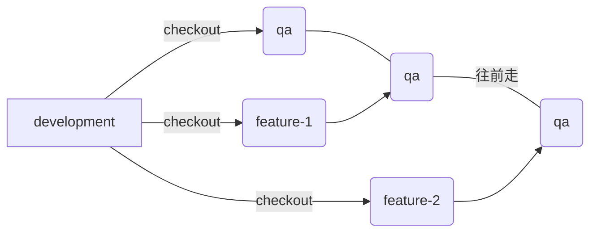

# develop workflow
## 1. 开始一个新的stroy
- 从development checkout 一个feature 分支， 开发完成之后 pull requeset 到development。

**原则上一个feature, 一个commit  格式如下：**
> *[Finishes STORY-CODE] xxxxxxxx(功能描述)*

> **Note:**  
> 如果这个story的功能太多，可以根据情况拆分commit. 
> 拆分的指导原则是尽量做到当需要revert 某个小功能的时候可以很方面的revert某个commit.

- 建议
> 在一个story的开发完成之后的qa过程中， 肯定存在issue,  建议在修改issue的时候格外的加上一个commit来提交代码，而不是使用 git commit --amend 合并代码之后强推。这样做的原因是为了方便 code review和现在的发布流程.

## 2. 提交代码

 - 开发完成之后，把代码push 到远程仓库， 然后pull request 到development 分支
 > 这里提交pull request 之后，自己先在github review 一下自己代码的改动。初步筛查代码是否有冲突，是否有误改的代码等错误。
 - 将pull request 的链接发给需要review 你代码的同事提醒他review 你的代码，然后等待反馈

## 3. 代码发布
- code review 完之后，如果没有问题一般都会将这个feature发布到qa。自己跟进发布进度，发布成功之后，自己先在qa环境检查一下是否功能实现正确。 

1. 如果自己发现有问题，回到[第1步的建议](#开始一个新的stroy)
2. 如果没有问题，修改story的状态改为 ready for qa。然后等待反馈

